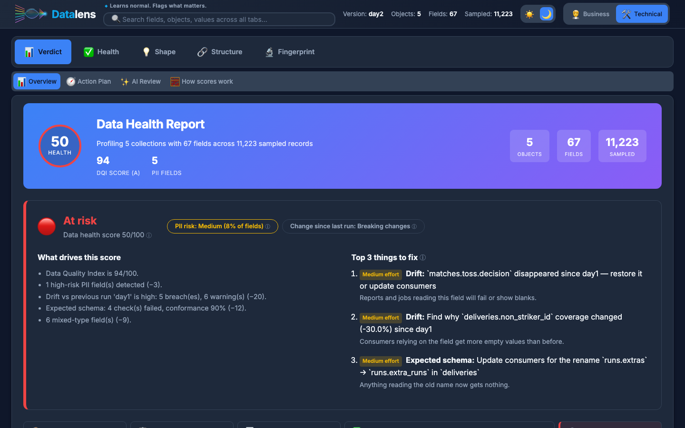
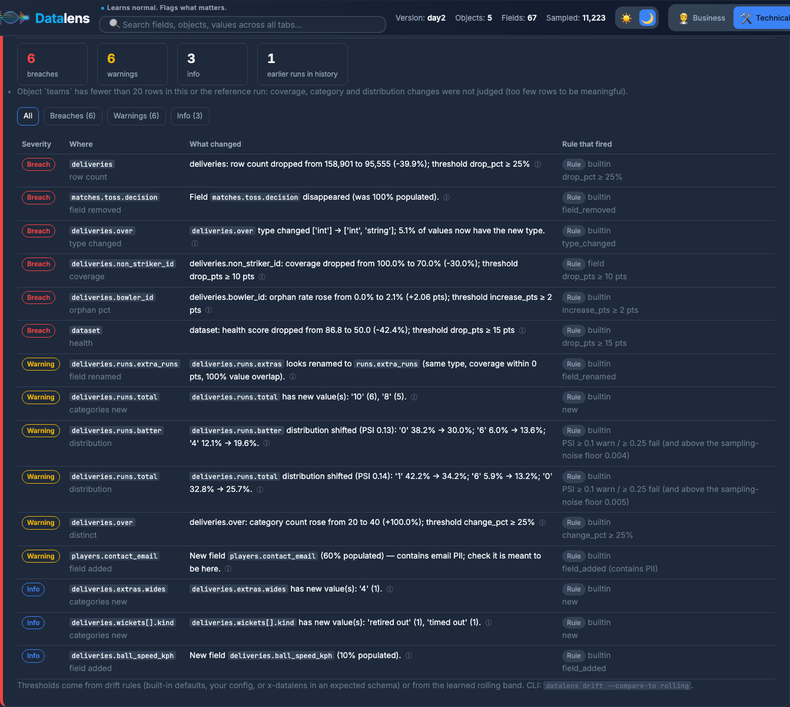
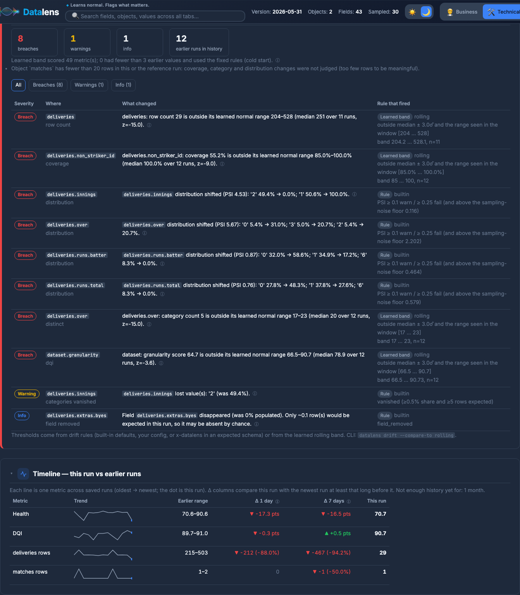
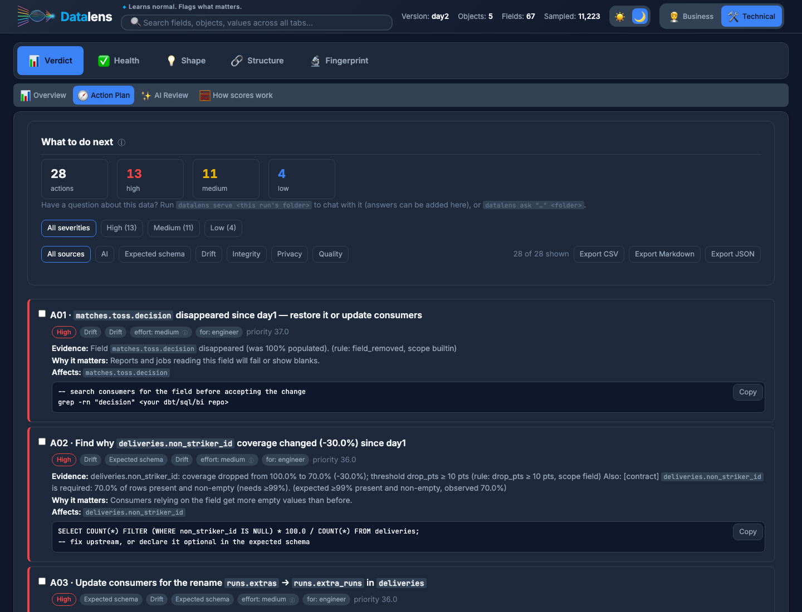
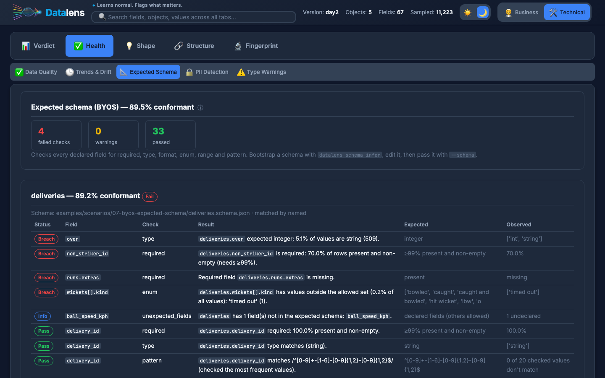
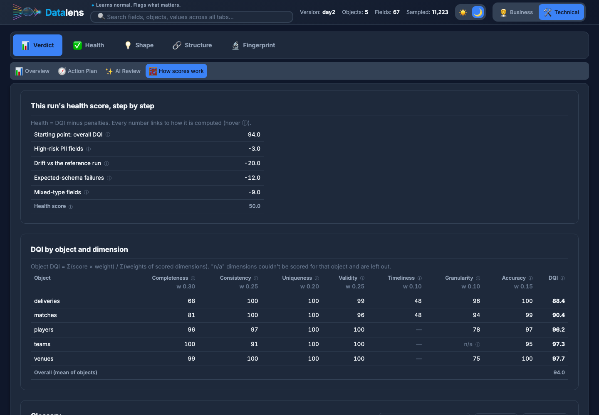
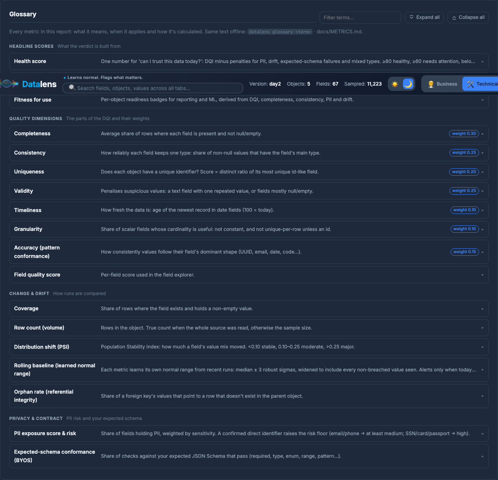
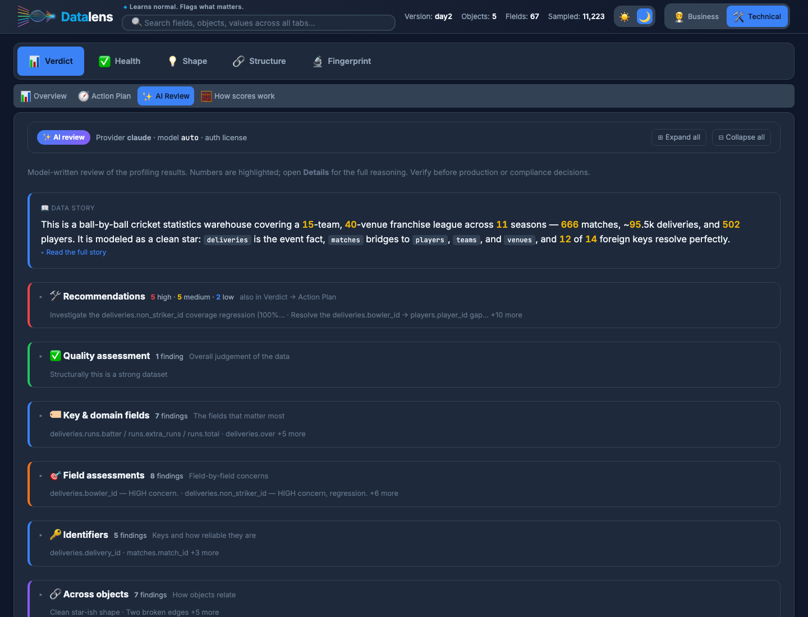
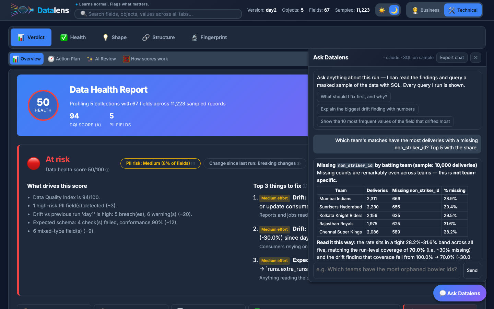

# Datalens.ai 🔍

**Data health intelligence that learns from your data, and tells you what to do next.**

*Learns normal. Flags what matters.*

Point Datalens at files, MongoDB, BigQuery, S3 or an HTTP API. It profiles every object and field, scores quality with
formulas you can read, finds keys, foreign keys and orphans, masks PII, learns what *normal* looks like for your
feed, checks it against the schema you expect, and turns every finding into a prioritised action — in one
offline HTML report, a JSON summary for CI/CD, and an optional chat you can ask follow-up questions.

[](LICENSE)
[](https://www.python.org/downloads/)



---

## Contents

- [Day 1 vs day 2 in 60 seconds](#day-1-vs-day-2-in-60-seconds)
- [It learns what normal looks like](#it-learns-what-normal-looks-like)
- [It tells you what to do next](#it-tells-you-what-to-do-next)
- [Bring your own schema (BYOS)](#bring-your-own-schema-byos)
- [Every number explains itself](#every-number-explains-itself)
- [Wire it into CI/CD](#wire-it-into-cicd)
- [AI review and chat](#ai-review-and-chat)
- [Coming from variety.js?](#coming-from-varietyjs)
- [Install](#install) · [Examples](#examples-for-every-scenario) · [Docs](#documentation)

---

## Day 1 vs day 2 in 60 seconds

The repo ships a real, related dataset: IPL cricket from [Cricsheet](https://cricsheet.org) — five entities
(`matches`, `deliveries`, `players`, `teams`, `venues`), ~160K rows, nested objects and arrays. Day 2 is the next
load with **10 deliberate problems** injected.

```bash
datalens analyze -s file -p test_data/cricket/day1 --pattern "*.jsonl.gz" -o output/demo --version-tag day1
datalens analyze -s file -p test_data/cricket/day2 --pattern "*.jsonl.gz" -o output/demo --version-tag day2 --detect-drift
```

| Injected on day 2 | Found as |
|---|---|
| `runs.extras` renamed to `runs.extra_runs` | **likely rename** (same type, coverage and values) |
| `over` int → string in 5% of rows | **type change**, with the share of new-type values |
| new `ball_speed_kph`, 90% null | new field, 10% populated |
| `toss.decision` dropped | **removed field** (was 100% populated) |
| `non_striker_id` null in 30% of rows | **coverage** 100% → 70% |
| more 4s and 6s in `runs.batter` | **distribution shift** (PSI 0.13, top movers listed) |
| new wicket kind, new venue | **new category values** |
| 40% of deliveries missing | **row count** 158,901 → 95,555 |
| synthetic `players.contact_email` | **new field containing email PII** — masked in every output |
| 2% of `bowler_id` point to no player | **orphan rate** 0% → 2.1% on `deliveries.bowler_id → players.player_id` |

Along the way it also finds real issues in the source: `season` is an integer for 2017–2019 and a string
(`"2020/21"`, `"2022"`) afterwards — across five fields in three objects, reported as **one** root cause.



---

## It learns what normal looks like

Real feeds wobble. In IPL, most days have one match (~250 deliveries) and some have two (~500). Fixed
day-over-day thresholds cry wolf on every double-header; ignoring volume misses a truncated load.

With `--compare-to rolling`, each metric — row counts, coverage of every field, category counts, orphan rates,
every score — learns its own normal range from recent runs:

```
M = median(last N values)      MAD = median(|x − M|)      σ̂ = 1.4826·MAD   (robust: one bad day can't inflate it)
band = [min(M − 3σ̂ₑ, min seen·0.95),  max(M + 3σ̂ₑ, max seen·1.05)]      σ̂ₑ = max(σ̂, 5%·|M|, sampling noise)
```

Recurring patterns are learned as normal, runs that breached are kept out of the baseline, and values seen
anywhere in the window aren't "new". Replaying 12 real match days plus one broken load (feed truncated, 30% nulls):

| | Normal days alerted | Broken day |
|---|---|---|
| Fixed day-over-day rules (`--detect-drift`) | **9 of 11** | caught |
| Learned baseline (`--compare-to rolling`) | 2 during the 3-run cold start, then **0 of 9** | caught — rows 29 vs normal 204–528, `non_striker_id` 55% vs 85–100%, `innings` lost value `2` |



Try it: [`examples/scenarios/05-rolling-daily-baseline`](examples/scenarios/05-rolling-daily-baseline/README.md).
Prefer fixed rules? Every threshold is configurable per dataset, object and field, with separate drop and
increase limits and your own messages — see [Drift rules](docs/USAGE.md#drift-rules--thresholds-per-dataset-object-and-field).

---

## It tells you what to do next

The **Action Plan** turns every finding — drift, expected-schema failures, PII, orphans, mixed types, stale data,
AI suggestions — into one action with the evidence, why it matters, the affected fields and a copy-ready fix.
Related findings are merged (the rename explains "required field missing"), priorities come from severity and
breadth, and you can tick items off and export the plan as CSV, Markdown or JSON.



---

## Bring your own schema (BYOS)

Tell Datalens what the data *should* look like with a JSON Schema — required fields, types, enums, ranges,
patterns — and put thresholds right next to the fields:

```json
{"title": "orders", "type": "object", "required": ["id", "title"],
 "x-datalens": {"defaults": {"coverage": {"change_pct": 20}}},
 "properties": {
   "id":      {"type": "string", "x-datalens": {"coverage": {"drop_pct": 5}}},
   "title":   {"type": "string", "x-datalens": {"coverage": {"drop_pct": 10}}},
   "country": {"type": "string", "x-datalens": {"coverage": {"change_pct": 20}}}}}
```

```bash
datalens schema infer -s file -p data/ -o expected.json     # no schema yet? learn one from a good load, then edit it
datalens analyze -s file -p data/ --schema expected.json --detect-drift
```

Failures show up in **Health → Expected Schema**, in the Action Plan, in the health score and in the CI exit code.



---

## Every number explains itself

Hover any ⓘ for what a metric means and how it's calculated. **Verdict → How scores work** shows this run's
health score step by step and the DQI of every object and dimension with its weight. The same definitions are in
[docs/METRICS.md](docs/METRICS.md) and in the terminal (`datalens glossary dqi`), generated from the code's own
constants so they can't disagree.

| Score | In one line |
|---|---|
| **Health** | DQI minus penalties for high-risk PII, drift, expected-schema failures and mixed types |
| **DQI** | weighted mean of the dimensions below, per object; overall = mean of objects |
| Completeness (0.30) | share of rows with a non-empty value; nested fields measured against their parent |
| Consistency (0.25) | share of non-null values with the field's main type |
| Uniqueness (0.20) | does each object have a unique identifier? |
| Validity (0.25) | penalises placeholder-like constant text and mostly-empty fields |
| Timeliness (0.10) | age of the newest record (100 = today) |
| Granularity (0.10) | fields with useful cardinality (not constant, not unique free text) |
| Accuracy (0.15) | how consistently values follow their field's dominant pattern |





---

## Wire it into CI/CD

Everything in the report is available from the CLI:

```bash
datalens analyze --cc nightly_export -o output --version-tag "$(date +%F)" --run-date "$(date +%F)" \
  --compare-to rolling --schema expected.json \
  --fail-on fail --min-score health=70,dqi=85 --max-drop dqi=5 \
  --notify "slack:$SLACK_WEBHOOK" --format json > summary.json
```

Exit codes: `0` ok · `1` warnings (with `--fail-on warn`) · `2` breach or failed gate · `3` error.
Also: `datalens scores`, `datalens drift` (re-check from history without reading data), `datalens history list`.
A ready GitHub Actions workflow is in [`examples/scenarios/08-ci-gate`](examples/scenarios/08-ci-gate/README.md).

---

## AI review and chat

Datalens is fully useful offline. Add `--ai claude` (logged-in Claude CLI), `anthropic`, `openai`, `cursor` or
`copilot` (the model is `auto` unless you pin one with `--ai-model`; a rejected model falls back to auto) and a
model reviews the findings — schema, keys, orphans, drift — and adds domain-aware recommendations
to the Action Plan, marked **AI** — shown as scannable finding cards (gist, highlighted numbers, details on
demand) in **Verdict → AI Review**. No sample values are sent; PII fields are flagged as masked.

Then ask follow-up questions:

```bash
datalens serve output/demo/day2_day2      # report + chat on http://127.0.0.1:8765
datalens ask "Which bowler ids are orphaned most often?" output/demo/day2_day2
```

The model can run **read-only SQL on a PII-masked sample** of the data; every query is shown with the answer.
Answers can be downloaded (CSV/Markdown), added to the Action Plan, or the whole session exported. Localhost
only, per-session token, and the report file is never changed.





---

## Coming from variety.js?

`variety.js` tells you which keys exist, with which types, in what share of documents. That's where Datalens starts:

| | variety.js | Datalens |
|---|---|---|
| Keys, types, occurrence % (nested, arrays) | ✅ | ✅ |
| Value distributions and examples | – | ✅ |
| Quality scores with visible formulas | – | ✅ |
| PII detection and masking | – | ✅ |
| Primary keys, foreign keys and orphans across collections | – | ✅ |
| Drift vs yesterday, a baseline, or a learned normal range | – | ✅ |
| Expected-schema (BYOS) checks | – | ✅ |
| Prioritised action plan, CI exit codes, notifications | – | ✅ |
| AI review and chat over the data | – | ✅ |

```bash
datalens analyze --source mongodb --uri "$MONGO_URI" --db shop --collections orders,customers --detect-drift
datalens analyze --source bigquery --project my-proj --dataset shop --tables orders,customers --detect-drift
```

---

## Install

```bash
git clone https://github.com/m8d8/datalens.ai.git
cd datalens.ai
uv sync                      # or: pip install -e .
uv sync --extra ai           # optional: Anthropic / OpenAI SDKs (CLI logins need nothing extra)
uv sync --extra bigquery     # optional: Google BigQuery connector
uv sync --extra dev          # tests: uv run pytest
```

Quick start on your own file:

```bash
uv run datalens analyze --source file --path data.csv --out-dir output
```

Each run writes to `output/<source>_<tag>/`: the HTML report, a run summary (JSON), the drift report and
expected-schema check (when used), the masked schema JSON, a markdown summary and, with `--ai`, the AI review.
Reusable connections with secrets kept out of git: [Connection Config Guide](docs/CONNECTION_CONFIG.md).

Library use:

```python
from datalens import analyze

result = analyze({"source": "file", "path": "data.csv"})
result.decision["health_verdict"]   # {'status': 'attention', 'score': 79.2, 'drivers': [...], 'penalties': {...}}
result.decision["next_steps"]       # every action with evidence and fix
result.drift_report                 # when a reference run is given
```

---

## Examples for every scenario

| | Scenario |
|---|---|
| 01 | [Profile one file](examples/scenarios/01-quickstart-single-file/README.md) |
| 02 | [Several related entities — keys, foreign keys, orphans](examples/scenarios/02-multi-entity-directory/README.md) |
| 03 | [What changed since yesterday?](examples/scenarios/03-day-over-day-drift/README.md) |
| 04 | [Compare with a fixed baseline](examples/scenarios/04-fixed-baseline/README.md) |
| 05 | [Daily drift with a learned baseline](examples/scenarios/05-rolling-daily-baseline/README.md) |
| 06 | [Custom thresholds per dataset, object and field](examples/scenarios/06-custom-drift-rules/README.md) |
| 07 | [BYOS — expected JSON Schema](examples/scenarios/07-byos-expected-schema/README.md) |
| 08 | [CI gate + notifications (GitHub Actions, cron)](examples/scenarios/08-ci-gate/README.md) |
| 09 | [AI review](examples/scenarios/09-ai-insights/README.md) |
| 10 | [MongoDB, coming from variety.js](examples/scenarios/10-mongodb-beyond-variety/README.md) |
| 11 | [PII controls](examples/scenarios/11-pii-controls/README.md) |
| 12 | [History and re-scoring past runs](examples/scenarios/12-history-and-rescoring/README.md) |

Reproduce every run and screenshot in this README: `AI=claude bash examples/demo/run_demo.sh`.

---

## Documentation

| Guide | What it covers |
|---|---|
| 📘 [Quick Start](docs/QUICKSTART.md) | First report in under 5 minutes. |
| 🛠️ [Usage Guide](docs/USAGE.md) | Every flag and command, drift modes and rules, BYOS, CI/CD, chat, library use. |
| 📊 [Report Guide](docs/REPORT_GUIDE.md) | Every tab and how to act on it. |
| 🧮 [Metrics](docs/METRICS.md) | Every score and check: what, when, and the exact formula. |
| 🔐 [Connection Config Guide](docs/CONNECTION_CONFIG.md) | Reusable connections with env-var secrets. |
| 🤖 [AI Providers](docs/AI_PROVIDERS.md) | Claude / Copilot / Cursor logins, Anthropic and OpenAI keys. |
| 🤝 [Contributing](CONTRIBUTING.md) | Add a connector via the `Connector` interface. |

---

## Data attribution

The demo data in `test_data/cricket/` is derived from [Cricsheet](https://cricsheet.org), available under the
[Open Data Commons Attribution License](http://opendatacommons.org/licenses/by/1.0/). Day 2 and the last daily
load contain deliberately injected problems and synthetic email addresses — see
[`test_data/cricket/ATTRIBUTION.md`](test_data/cricket/ATTRIBUTION.md). Regenerate with
`python examples/demo/build_demo_data.py`.

## License

MIT License — see [LICENSE](LICENSE).
