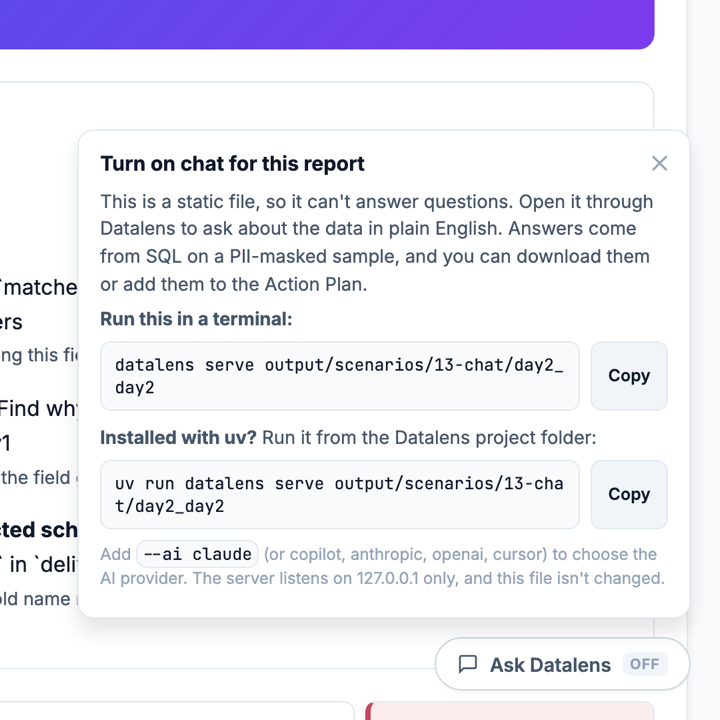

# Chat with your data

Every report can answer follow-up questions in plain English. Chat runs through `datalens serve`, which opens
the report on `127.0.0.1` with an **Ask Datalens** panel. The model reads the run's findings and can query a
**PII-masked sample** of the data with read-only SQL. Every query it runs is shown under the answer.


## Run

```bash
bash examples/scenarios/13-chat/run.sh                                  # auto-detect a provider
AI=copilot MODEL=claude-opus-5 bash examples/scenarios/13-chat/run.sh   # choose provider and model
```

It profiles day 1 and day 2 of the cricket demo, asks one question from the terminal, then starts the chat server:

```bash
datalens ask "Which 2 fields in each object have the lowest coverage? Show a table." output/scenarios/13-chat/day2_day2
datalens serve output/scenarios/13-chat/day2_day2
```

Chat works on **any** run folder, including runs made without `--ai`.

## A report opened directly has chat turned off

Double-clicking the HTML file opens a static page, which can't run queries. It shows a dimmed
**Ask Datalens · OFF** button in the bottom-right corner. Click it for the exact `serve` command for that
report's folder, with a **Copy** button. The Action Plan's **Turn on chat** link opens the same popover.



## Choose an AI provider

There are two kinds of provider. **Login** providers use a CLI you're already signed in to, so your
subscription covers the cost and no key is needed. **API** providers use a key and bill per call.

| `--ai` | Kind | You need |
|---|---|---|
| `claude` | Login | Claude Code CLI, signed in (`claude`) |
| `copilot` | Login | GitHub Copilot CLI (`npm i -g @github/copilot`, then run `copilot` to sign in), or `gh` with Copilot |
| `cursor` | Login | Cursor CLI, signed in (`cursor-agent`) |
| `anthropic` | API | `ANTHROPIC_API_KEY` and the `ai` extra (`pip install "datalens[ai]"`) |
| `openai` | API | `OPENAI_API_KEY` and the `ai` extra |
| `auto` (default) | — | Uses the first one available |

```bash
# Login: Claude Code CLI
datalens serve output/scenarios/13-chat/day2_day2 --ai claude

# Login: GitHub Copilot CLI
datalens serve output/scenarios/13-chat/day2_day2 --ai copilot

# API: Anthropic
export ANTHROPIC_API_KEY=sk-ant-...
datalens serve output/scenarios/13-chat/day2_day2 --ai anthropic

# API: OpenAI
export OPENAI_API_KEY=sk-...
datalens serve output/scenarios/13-chat/day2_day2 --ai openai
```

## Choose a model

The model is **auto** unless you pick one, and the chat header shows the provider and model in use
(e.g. `copilot · claude-opus-5`).

```bash
datalens serve output/scenarios/13-chat/day2_day2 --ai copilot   --ai-model claude-opus-5
datalens serve output/scenarios/13-chat/day2_day2 --ai claude    --ai-model claude-sonnet-5-5
datalens serve output/scenarios/13-chat/day2_day2 --ai anthropic --ai-model claude-opus-5-5
datalens ask "Why did health drop?" output/scenarios/13-chat/day2_day2 --ai openai --ai-model gpt-4o
```

To set a default instead of passing the flag each time, add it to `secrets.yaml`:

```yaml
copilot:
  model: claude-opus-5
anthropic:
  api_key: sk-ant-...
  model: claude-opus-5-5
```

Precedence: `--ai-model` → provider `model:` in secrets.yaml → `DATALENS_<PROVIDER>_MODEL` env var → auto.
If the provider rejects the model, Datalens logs a warning and retries on auto, so a typo never stops the chat.

## What you can do in the panel

- Ask anything, or click a suggested question to start.
- Answers come as text and tables. **Download MD** saves one answer, and **Export chat** saves the whole session.
- **Add to Action Plan** puts an answer into **Verdict → Action Plan**, tagged as coming from chat (kept in this browser).

## Options

| Flag | Default | Meaning |
|---|---|---|
| `--ai` | `auto` | AI provider (see above) |
| `--ai-model` | `auto` | Model for that provider |
| `--port` | `8765` | Local port, bound to 127.0.0.1 only |
| `--sample-size` | `20000` | Rows per object loaded for SQL questions |
| `--no-open` | off | Don't open a browser |

## Privacy

- The server listens on `127.0.0.1` only and needs a per-session token, so other machines can't reach it.
- SQL runs on a masked sample: PII values are masked before the model sees them, and only `SELECT` is allowed
  (5-second and 200-row limits).
- The report file on disk is never changed.

See [docs/AI_PROVIDERS.md](../../../docs/AI_PROVIDERS.md) for provider setup and troubleshooting.
